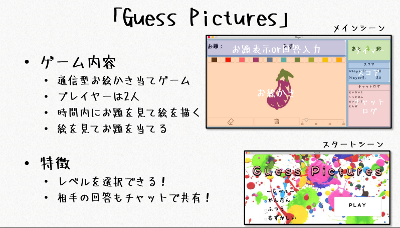
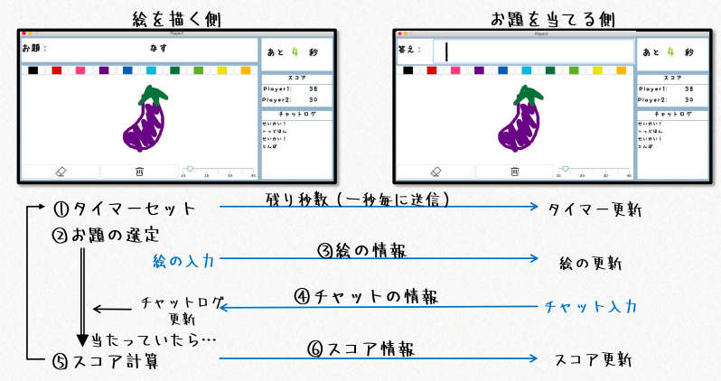
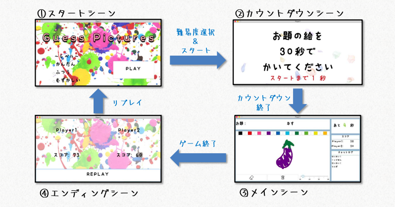
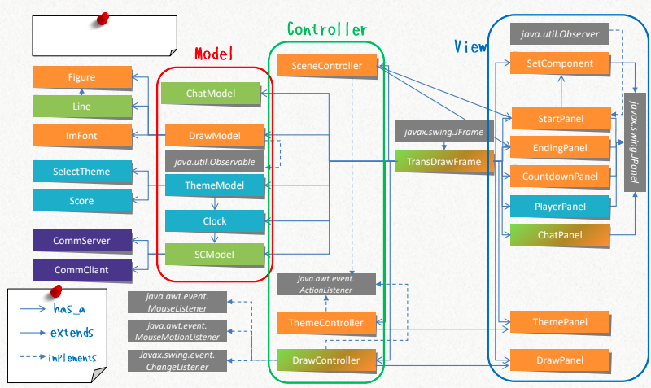

# 通信型お絵かきプログラム

### 概要
* 2人プレイヤーでお題の絵を当てる通信型お絵かきゲーム
* 制作日：2021年1月

### 内容
* メインシーン

* シーン遷移

* プログラム構成

### 使用技術
* Java

### 実行環境
terminalで二つのウィンドウを開き、
サーバー側では以下のコマンドを入力。 
`java -jar Oekaki.jar server`  
クライアント側では以下のコマンドを入力 
`java -jar Oekaki.jar client`
